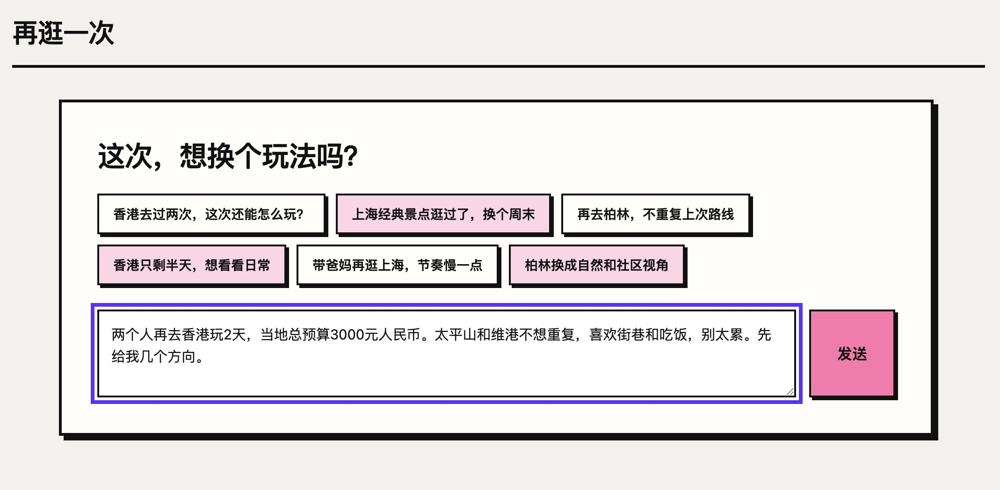
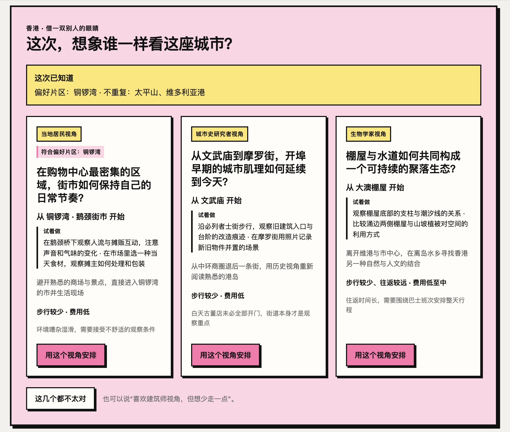
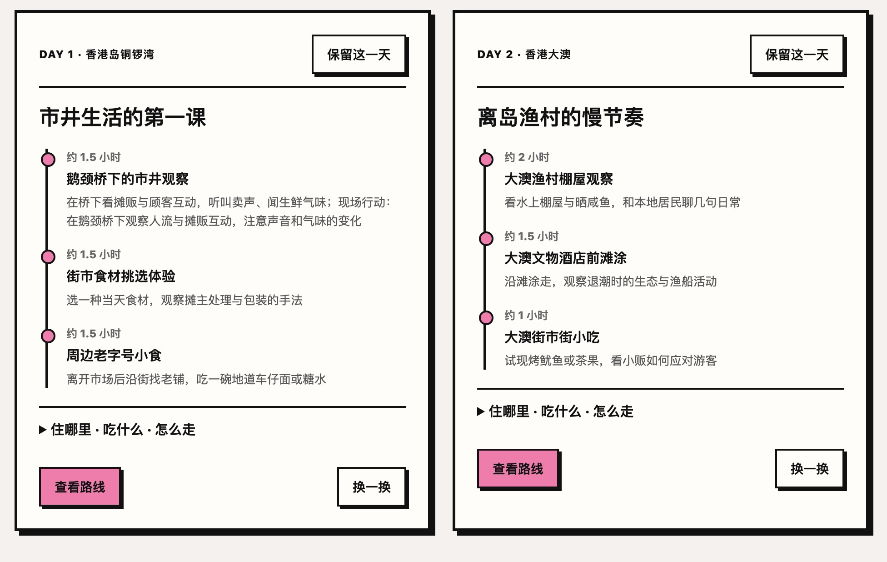
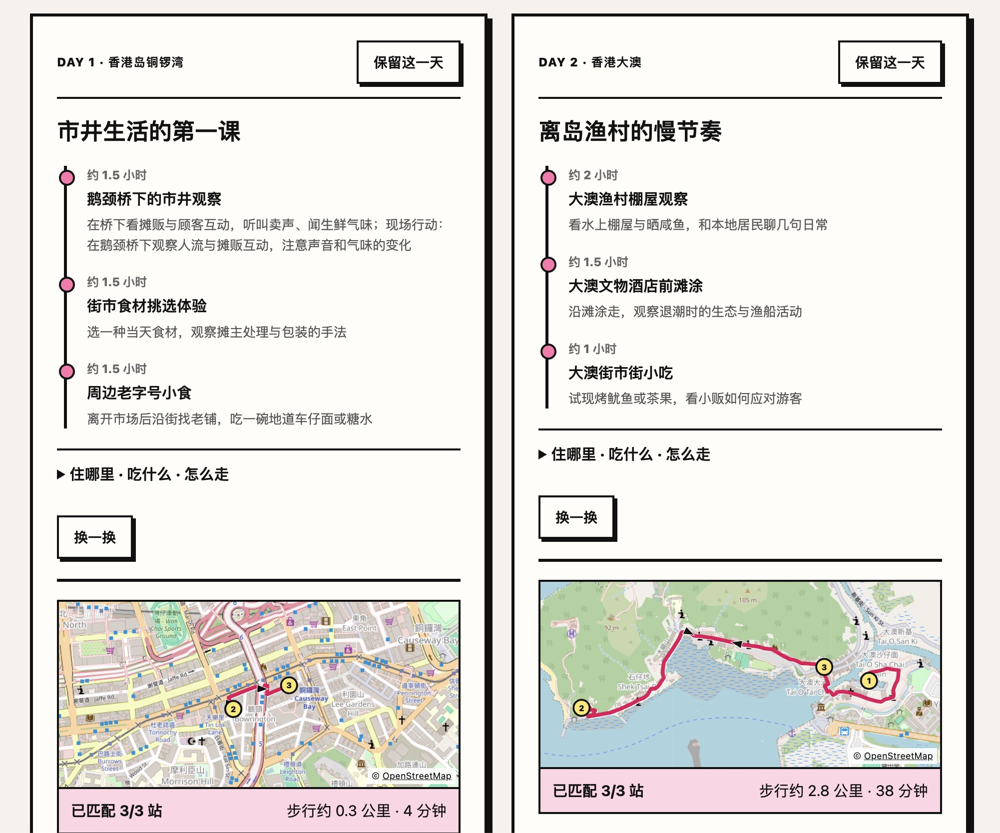
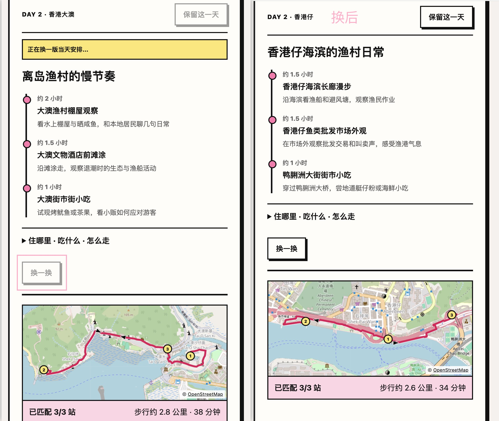

# 再逛一次

> 为去过一座城市的人，重新找到一条值得走的路线。

“再逛一次”是一款面向城市再访者的 AI 行程规划产品，目前支持香港、上海和柏林。它不从“必去景点清单”开始，而是先理解用户去过什么、想避开什么、这次对什么感兴趣，再借用不同角色的观察方式，把偏好变成可选择的旅行方向和可调整的每日路线。

## 目标用户

- 已经去过目的地，不想再次照着经典景点清单打卡的旅行者。
- 有明确兴趣、片区或节奏偏好，但不愿花大量时间整理攻略的人。
- 对路线重复和模板化推荐敏感，希望计划能跟着自己的表达变化的人。
- 愿意先选择一个旅行视角，再逐步确认预算、路线和具体安排的人。

## 使用场景

- 再次到访一座熟悉的城市，想避开已经去过的地方。
- 周末或短途旅行，希望在有限时间内找到一个有主题的玩法。
- 对某个片区、职业视角或生活方式感兴趣，想围绕它形成路线。
- 与伴侣、朋友或家人同行，需要同时考虑人数、预算、体力和禁区。
- 对初版计划大体满意，只想更换其中一天，而不想推翻整趟行程。

## 要解决的问题

### 1. 攻略信息很多，却没有降低决策难度

常见的行程助手会输出大段文字和很多地点，但用户仍然需要自己判断“为什么去、先去哪、这些地方是否顺路”。本产品先给少量方向供用户选择，再逐步展开预算、每日安排和路线范围。

### 2. 推荐容易重复，缺少属于这次旅行的理由

产品会同时考虑去过的地方、明确不想去的地方、偏好片区、兴趣和节奏。符合条件的方向不足时，可以少给或说明没有合适方案，而不是用相似素材凑满结果。

### 3. 角色只是包装，路线却与角色无关

这里的角色视角会参与路线生成。产品以“角色 × 地点 × 行动类型”组织方向：角色决定观察方式，地点提供真实锚点，行动说明用户到现场具体做什么。

### 4. 修改一次，整条路线就失去原来的重点

用户选择方向后，系统会保留该方向的地点锚点和核心行动。用户可以锁定满意的某一天，也可以只对某一天“换一换”，让其他天保持不变。

## 产品思路

```text
自然语言需求 → 条件核对 → 角色方向 → 地点锚点与现场行动 → 每日路线 → 按天调整
```

角色不是一个文案标签，而是一套筛选和组织路线的方法。例如，建筑师更关注空间、材料和城市变化，厨师更关注市场、食材和进餐节奏，音乐家更关注声音、演出场所和城市的夜间脉搏，人类学家更关注社区关系、地方习俗和日常生活，当地居民则更关注社区日常与生活动线。

## 主要流程

### 1. 用自然语言说明这次想怎么玩

用户可以一次写下目的地、同行人、预算、天数、去过的地方、兴趣和体力要求，也可以从示例问题开始。



### 2. 核对并补充旅行条件

系统把自然语言整理为表单。目的地、人数、预算和天数为必填项；偏好片区、不去哪里、出发地和日期可以补充或修改。这样可以在生成前发现遗漏，避免系统忽略用户已经说过的信息。


### 3. 选择一个角色方向

系统根据用户条件召回并排序地点素材，再生成最多三个不同的角色方向。每张卡片会说明观察视角、起始锚点、现场行动、适配理由、步行和费用预期。偏好片区也会直接显示，用户不需要依靠陌生地名猜测是否符合要求。



### 4. 查看行程简介和预算

选定方向后，用户先看到地点锚点、核心行动、预算估算和费用构成，并可以通过预算滑块调整方案。


### 5. 查看按天组织的行程

系统将所选方向展开为每日约 4–6 小时的路线。每个停留点显示建议时长、地点和要做的事情；用户可以锁定满意的一天，防止后续调整改变它。



### 6. 查看路线范围

每一天都可以展开路线图，查看地点是否成功匹配、步行距离和预计时间，判断当天安排是否集中、是否需要调整。



### 7. 只更换不满意的一天

点击“换一换”后，系统会在已选方向内重新生成当天方案，其他天保持不变。如果当天包含所选方向的地点锚点，锚点和核心行动也会保留；系统还会记录已经展示过的地点，尽量减少重复。



## 主要功能

- **需求理解与确认**：从自然语言中提取旅行条件，并允许用户在生成前增删修改。
- **偏好与排除项**：同时处理偏好片区、去过的地方、不想去的地方、兴趣和节奏要求。
- **角色方向生成**：以不同职业或生活视角组织地点和行动，提供最多三个有差异的选择。
- **锚点绑定**：选定方向后，把代表该方向的地点与核心行动带入最终路线。
- **每日行程生成**：按天生成约 4–6 小时的计划，并显示每站建议停留时长。
- **预算调节**：展示预算估算和费用构成，支持通过滑块调整本地行程预算。
- **路线预览**：在地图中显示当天地点、步行顺序、距离、预计时间和地点匹配情况。
- **锁定某天**：保留已经满意的单日安排。
- **换一换**：只重做指定日期，并在同一角色方向内寻找新的地点组合；包含锚点的日期会保留锚点。
- **自然语言追问**：用户可以继续补充限制或表达不满意的原因，让系统据此调整方案。

## 当前范围

- 当前支持香港、上海和柏林，主要面向已经去过目的地的旅行者。
- 地点候选来自本地内容库，尚未接入实时全网检索；价格、营业时间、预约要求等信息需要出发前再次确认。
- 预算用于住宿、餐饮、当地交通和游玩，不包含往返目的地的机票或火车票。
- 地图依赖外部地理编码和步行路线服务，用于判断路线范围，不代替实时导航。
- 会话保存在服务端内存和当前浏览器标签页，暂不支持账号体系或跨设备同步。

## 本地运行

需要 Node.js 22 或更高版本。

```bash
npm install
cp .env.example .env
```

在 `.env` 中填写 `DEEPSEEK_API_KEY`，然后运行：

```bash
npm run dev
```

打开 <http://127.0.0.1:5173>。
